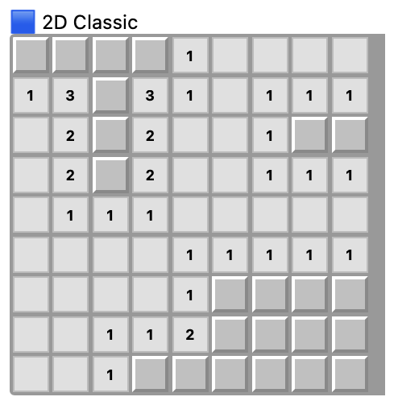
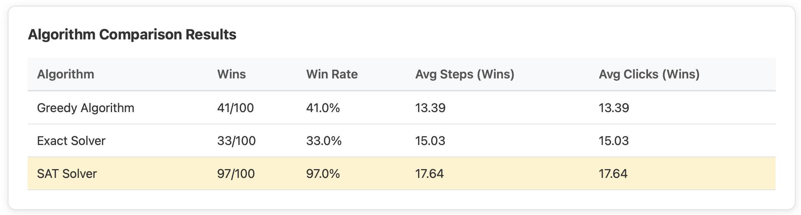
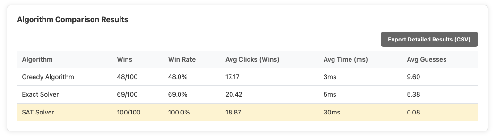
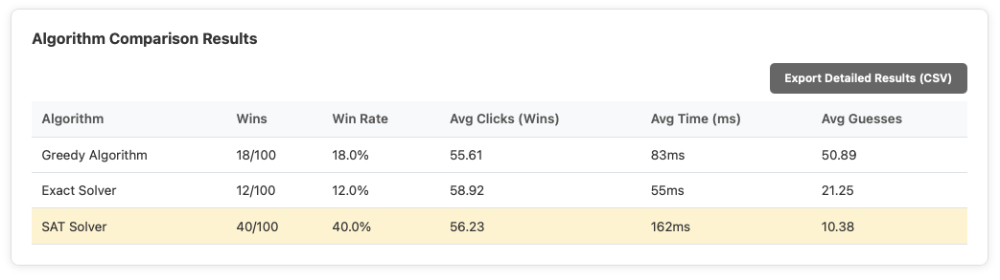

# 4D Hyperplane Minesweeper

### Live Demo

🔗 Deployed at : [https://feature-4dimension.tuberlin-sc-project.pages.dev](https://feature-4dimension.tuberlin-sc-project.pages.dev)
Please note that, for 4D option, it takes some time to load the results due to complextity

## Introduction

This project extends the classic Minesweeper game into four dimensions using a dimension-agnostic grid representation.  
The 4D version introduces additional spatial complexity while preserving the original rules and gameplay logic.  
Higher dimensions are conceptually straightforward extensions, but are not implemented as they offer limited new gameplay insight beyond 4D.

## Board Comparison

<p align="center">
  
  
</p>

<p align="center">
  <sub>Left: Traditional 2D interface &nbsp;&nbsp;&nbsp; | &nbsp;&nbsp;&nbsp; Right: Dimension-agnostic N-D interface (additional axes w = 0,1,...)</sub>
</p>

## Architecture


## Features

- Dimension-agnostic board (N-D support)
- 4D hyperplane prototype
- Multiple solvers (Greedy, SAT, Exact)
- Rust → WebAssembly high-performance engine
- Interactive React visualisation
- Fully client-side (no backend)

## Solvers

The project currently implements three solving strategies: Greedy, Exact, and SAT-based solvers.

To ensure a fair comparison across dimensions, we keep the mine density approximately constant:

`density = mines / total cells`

| Dim | Board   | Cells | Mines | Density |
| --- | ------- | ----- | ----- | ------- |
| 2D  | 9x9     | 81    | 10    | 12.3%   |
| 3D  | 4x4x4   | 64    | 8     | 12.5%   |
| 4D  | 3x3x3x3 | 81    | 10    | 12.3%   |

This normalises board difficulty and allows solver behaviour to be compared under similar conditions.

### 2D (9x9, 10 mines)



### 3D (4x4x4, 8 mines)



### 4D (3x3x3x3, 10 mines)



### Observations

- The SAT solver achieves the highest win rate across all dimensions, showing strong logical completeness and robustness.
- The Greedy solver is typically faster and requires fewer clicks, but is less reliable due to heuristic decisions.
- The Exact solver guarantees correctness locally but can be slower and less practical on small boards due to computational overhead.
- As dimensionality increases, the search space grows rapidly, making logical and constraint-based approaches more advantageous than pure heuristics.

### Evaluation Metrics

- Wins / Win Rate  
  Measures how often the solver successfully clears the board.

- Avg Steps (Wins)  
  Average number of logical steps taken in successful runs.  
  Lower values generally indicate more efficient reasoning.

- Avg Clicks (Wins)  
  Number of revealed cells.  
  Fewer clicks imply better information usage.

- Efficiency Score  
  efficiency = completion (%) / clicks  
  Measures how much progress is achieved per click (information gain).

- Normalised Time per Move  
  time_per_move = total_time / clicks  
  Approximates computational cost per decision and serves as a proxy for algorithmic complexity.

- Success-adjusted Efficiency  
  score = win_rate × completion × (1 / time)  
  Balances speed, reliability, and completeness into a single overall score.

- Stability (Variance)  
  std(clicks), std(time), std(completion)  
  Measures consistency. Lower variance indicates more predictable behaviour.

## Getting Started

### How to setup the Environment

```bash
# clone this repo
git clone https://github.com/TU-Berlin-SC/Scientific_Computing_Project.git

# Make sure you have Rust (I'm sure we all do)
curl --proto '=https' --tlsv1.2 -sSf https://sh.rustup.rs | sh

# Install wasm-pack
cargo install wasm-pack

# Check your Node.js (v18 or higher)
node -v
npm -v

# and do you perhaps have npm installed?
npm install -g npm@latest
```

### How to Build for the first time

```bash
cd engine # Backend route
cargo check # check dependencies
cargo update # Update dependencies
wasm-pack build --target web --out-dir ../frontend/src/wasm_pkg # WASM Build

cd ../frontend # frontend
npm i # only install for first time
npm run build
npm run dev
```

After building for first time,
(Also, I recommend to use separate bash to run front and backend)

### Backend

```bash
cd engine
cargo update # Update dependencies
wasm-pack build --target web --out-dir ../frontend/src/wasm_pkg # WASM Build
```

### Frontend

```bash
cd frontend
npm run dev # this allows to show your changes in real time with the url it gives you
```

---

# Architecture

```bash
.
├── Readme.md
├── engine
│   ├── Cargo.toml # add library dependencies
│   ├── Readme.md
│   ├── src
│   │   ├── algorithms          # <- this is where we put our algorithms!
│   │   │   ├── exact_solver.rs # exact solver using ilp
│   │   │   ├── greedy.rs       # greedy (but it's not so good right now)
│   │   │   ├── sat_solver.rs   # for later
│   │   │   ├── macros.rs       # macro tool to make my life easier
                                #(so we dont have to call 239048 times of our new algorithm)
│   │   │   └── mod.rs # [IMPORTANT] you need to add your algorithm here as well!
│   └─── board.rs               # common module for our board logic
│     ├── lib.rs                # WebAssembly module for simulation
└── frontend
    ├── src
    │   ├── App.css
    │   ├── App.tsx
    │   ├── assets
    │   │   └── react.svg
    │   ├── components
    │   │   ├── AlgorithmSelector.css
    │   │   ├── AlgorithmSelector.tsx
    │   │   ├── BoardView.css
    │   │   ├── BoardView.tsx
    │   │   ├── InteractiveNDBoard.css
    │   │   ├── InteractiveNDBoard.tsx # added
    │   │   ├── Controls.css
    │   │   ├── Controls.tsx
    │   │   ├── ResultView.css
    │   │   └── ResultView.tsx
    │   ├── index.css
    │   ├── main.tsx
    │   ├── types
    │   │   ├── simulation.ts
    │   │   └── wasm.d.ts
    │   └── utils
    │       └── visualization.ts
    ├── tsconfig.app.json
    ├── tsconfig.json
    ├── tsconfig.node.json
    └── vite.config.ts

```

### Setting up Cloudflare pages

took me forever but..this is only for my reference. it's already all setup.

```
Build configuration
Build command:
if ! command -v rustc &> /dev/null; then curl --proto '=https' --tlsv1.2 -sSf https://sh.rustup.rs | sh -s -- -y; . "$HOME/.cargo/env"; fi && if ! command -v wasm-pack &> /dev/null; then curl https://rustwasm.github.io/wasm-pack/installer/init.sh -sSf | sh; fi && cd ../engine && wasm-pack build --target web --out-dir ../frontend/src/wasm_pkg && cd ../frontend && npm run build
Build output:
dist
Root directory:
frontend
Build comments:
Enabled
```

and vite.config.ts, package.json, and \_headers had to be modified as well

### How to add to our codes?

still working on writing this.

```bash
# create branch
# git add <files>
# git commit -m "something"
# git push
# pull requst & merge
# if we merge it, let's update our tag as well
```
