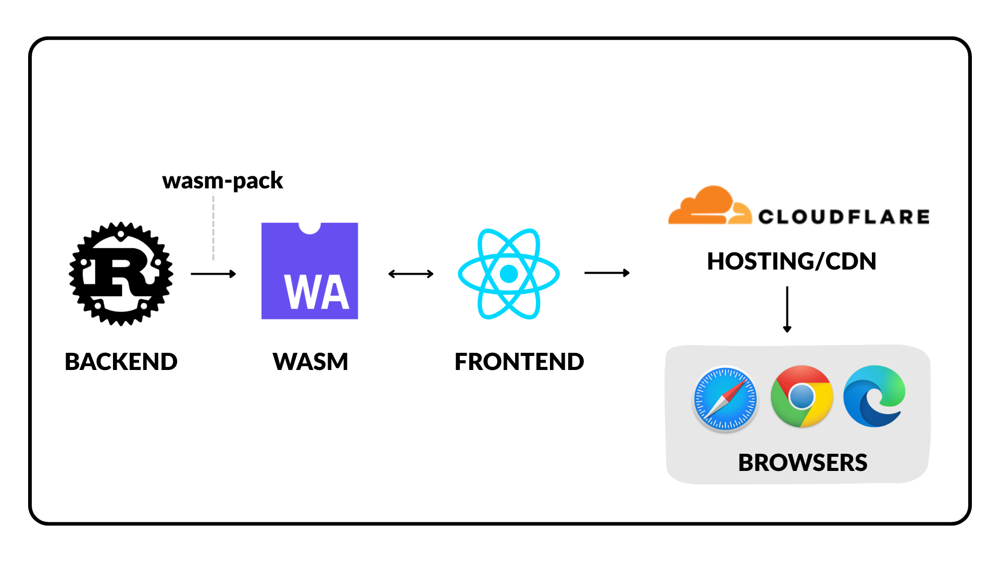
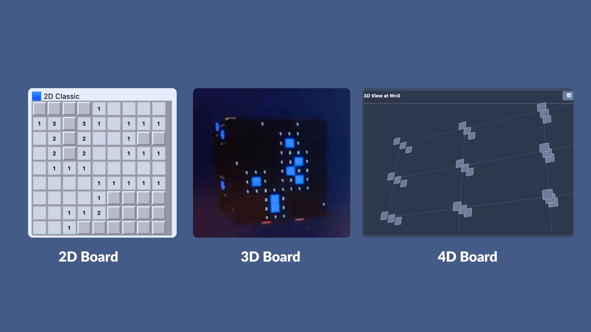
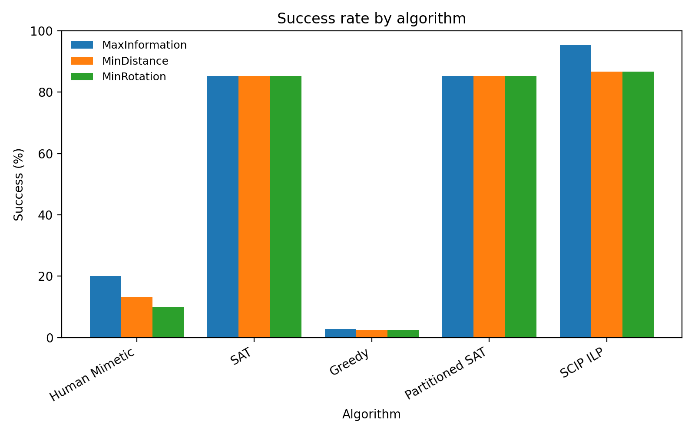
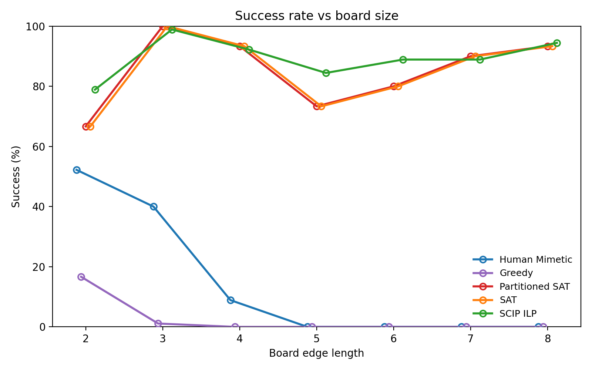
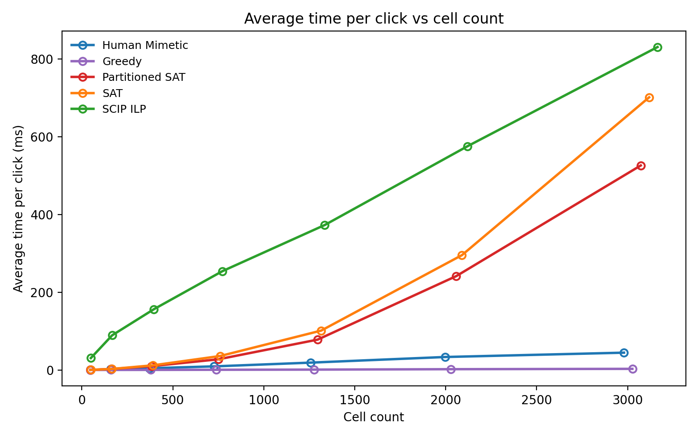
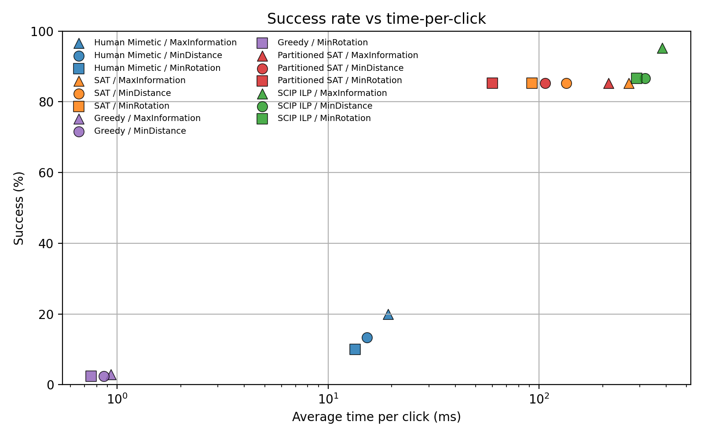

# N-Dimensional Minesweeper Solver

### Evaluating Algorithm Performance and Movement Prioritisation in 3D/4D Minesweeper

This project extends the classical 2D Minesweeper game into **3D and higher dimensions** and studies how different solving algorithms behave under increased logical and topological complexity.

It accompanies our research paper:

> _Evaluating Algorithm Performance and Movement Prioritisation in 3D Minesweeper_

We compare **heuristic**, **constraint-based**, and **exact optimisation** solvers on:

- win rate
- efficiency
- computational cost
- user-experience metrics (movement & rotations)

The system is built as:

**Rust engine → WebAssembly → React visualisation**, fully client-side.

---

## Live Demo

### 3D Minesweeper

⚠️ Deployment currently failing on this branch. Will be fixed soon.

### 4D Hyperplane Minesweeper

Because N-dimensional support required both backend and frontend reconstruction, this version is deployed from the feature branch.

- 🔗 https://feature-4dimension.tuberlin-sc-project.pages.dev
- 🔗 Source: https://github.com/TU-Berlin-SC/Scientific_Computing_Project/tree/feature/4dimension

> Note: 4D boards take longer to load due to higher constraint density.

Sample benchmark CSV:  
`assets/algorithm_comparison_summary.csv`

---

## Architecture



**Stack**

- Rust core solver engine
- WebAssembly build
- React frontend
- Fully client-side execution (no backend)

---

## Board Visualisation

### UI examples



---

## Features

- Dimension-agnostic board (supports arbitrary N)
- 3D cube surface Minesweeper
- 4D hyperplane prototype with slice navigation
- Multiple solving algorithms
- Automated benchmarking & CSV export
- Interactive visualisation
- High-performance Rust → WASM

---

# Solvers

The project currently implements three families of strategies:

## Greedy (Heuristic)

- Local neighbour reasoning
- Human-like rules
- Falls back to probability when stuck
- Very fast
- Low success rate on large boards

## SAT (Exact logical solver)

- Converts board → CNF constraints
- Uses DPLL reasoning
- Proves safety by contradiction
- High win rate
- Moderate computational cost

## Exact / ILP

- Integer Linear Programming formulation
- Binary variables per cell
- Global optimisation
- Highest success rate
- Slowest runtime

---

# 3D Results

### Overall success rate

| Algorithm       | Success Rate |
| --------------- | ------------ |
| Human Mimetic   | 14.4%        |
| Greedy          | 2.5%         |
| SAT             | 85.2%        |
| Partitioned SAT | 85.2%        |
| SCIP ILP        | **89.5%**    |

### Results

|                                                       |                                                           |
| ----------------------------------------------------- | --------------------------------------------------------- |
|               |        |
|  |  |

# Observations

### Solver quality

- Exact methods (SAT/ILP) dominate win rate
- Heuristics fail on large boards

### Scaling behaviour

- Constraint count grows exponentially with dimension
- Partitioning significantly reduces SAT runtime

### Trade-off

- Greedy → fastest but unreliable
- ILP → most accurate but slow
- SAT → best balance

### Movement objectives matter

- Information-gain prioritisation improves success
- Distance minimisation improves UX smoothness
- Rotation minimisation reduces camera overhead

---

# Evaluation Metrics

We evaluate solvers using:

### Win metrics

- **Wins / Win Rate** – how often the board is cleared

### Efficiency

- **Avg Steps (Wins)** – logical deductions needed
- **Avg Clicks (Wins)** – information usage
- **Efficiency Score** = completion / clicks

### Computational cost

- **Normalised time per move** = time / clicks

### Combined score

- **Success-adjusted efficiency**  
  balances reliability + speed + completeness

### Stability

- variance of clicks / time / completion

---

# 🔬 4D Hyperplane Prototype

To test scalability, we generalised the board to **N dimensions**.

Each cell: neighbors = `3^d − 1`

| Dimension | Neighbours |
| --------- | ---------- |
| 2D        | 8          |
| 3D        | 26         |
| 4D        | 80         |

The 4D board is visualised as **3D slices along the w-axis**.

### Win rates (100 boards)

| Dimension | Greedy | Exact | SAT |
| --------- | ------ | ----- | --- |
| 2D        | 36%    | 41%   | 95% |
| 3D        | 20%    | 14%   | 97% |
| 4D        | 4%     | 9%    | 50% |

**Key takeaway:**  
Higher dimension ⇒ combinatorial explosion ⇒ lower win rate + longer solve time.

---

# Getting Started

### How to setup the Environment

```bash
# clone this repo
git clone https://github.com/TU-Berlin-SC/Scientific_Computing_Project.git

# Make sure you have Rust (I'm sure we all do)
curl --proto '=https' --tlsv1.2 -sSf https://sh.rustup.rs | sh

# Install wasm-pack
cargo install wasm-pack

# Check your Node.js (v18 or higher)
node -v
npm -v

# and do you perhaps have npm installed?
npm install -g npm@latest
```

### How to Build for the first time

```bash
cd engine # Backend route
cargo check # check dependencies
cargo update # Update dependencies
wasm-pack build --target web --out-dir ../frontend/src/wasm_pkg # WASM Build

cd ../frontend # frontend
npm i # only install for first time
npm run build
npm run dev
```

After building for first time,
(Also, I recommend to use separate bash to run front and backend)

### Backend

```bash
cd engine
cargo update # Update dependencies
wasm-pack build --target web --out-dir ../frontend/src/wasm_pkg # WASM Build
```

### Frontend

```bash
cd frontend
npm run dev # this allows to show your changes in real time with the url it gives you
```

---

# Architecture

```bash
.
├── Readme.md
├── engine
│   ├── Cargo.toml # add library dependencies
│   ├── Readme.md
│   ├── src
│   │   ├── algorithms          # <- this is where we put our algorithms!
│   │   │   ├── exact_solver.rs # exact solver using ilp
│   │   │   ├── greedy.rs       # greedy (but it's not so good right now)
│   │   │   ├── sat_solver.rs   # for later
│   │   │   ├── macros.rs       # macro tool to make my life easier
                                #(so we dont have to call 239048 times of our new algorithm)
│   │   │   └── mod.rs # [IMPORTANT] you need to add your algorithm here as well!
│   └─── board.rs               # common module for our board logic
│     ├── lib.rs                # WebAssembly module for simulation
└── frontend
    ├── src
    │   ├── App.css
    │   ├── App.tsx
    │   ├── assets
    │   │   └── react.svg
    │   ├── components
    │   │   ├── AlgorithmSelector.css
    │   │   ├── AlgorithmSelector.tsx
    │   │   ├── BoardView.css
    │   │   ├── BoardView.tsx
    │   │   ├── InteractiveNDBoard.css
    │   │   ├── InteractiveNDBoard.tsx # added
    │   │   ├── Controls.css
    │   │   ├── Controls.tsx
    │   │   ├── ResultView.css
    │   │   └── ResultView.tsx
    │   ├── index.css
    │   ├── main.tsx
    │   ├── types
    │   │   ├── simulation.ts
    │   │   └── wasm.d.ts
    │   └── utils
    │       └── visualization.ts
    ├── tsconfig.app.json
    ├── tsconfig.json
    ├── tsconfig.node.json
    └── vite.config.ts

```

### Setting up Cloudflare pages

took me forever but..this is only for my reference. it's already all setup.

```
Build configuration
Build command:
if ! command -v rustc &> /dev/null; then curl --proto '=https' --tlsv1.2 -sSf https://sh.rustup.rs | sh -s -- -y; . "$HOME/.cargo/env"; fi && if ! command -v wasm-pack &> /dev/null; then curl https://rustwasm.github.io/wasm-pack/installer/init.sh -sSf | sh; fi && cd ../engine && wasm-pack build --target web --out-dir ../frontend/src/wasm_pkg && cd ../frontend && npm run build
Build output:
dist
Root directory:
frontend
Build comments:
Enabled
```

and vite.config.ts, package.json, and \_headers had to be modified as well

### How to add to our codes?

still working on writing this.

```bash
# create branch
# git add <files>
# git commit -m "something"
# git push
# pull requst & merge
# if we merge it, let's update our tag as well
```
